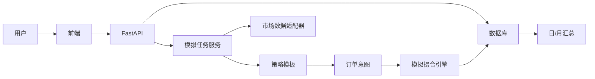

# 架构设计

## 设计原则

本项目借鉴 QuantDinger 的分层方式，但只保留学习型模拟交易需要的部分：

- 保留：用户、模拟账户、策略任务、市场数据、模拟撮合、交易日志、汇总分析。
- 移除：真实交易、券商密钥管理、商业化计费、会员、支付、AI 付费额度、真实资金执行。
- 预留：税费、手续费、滑点、T+1、交易日历、资产类型、风控规则。

## 后端分层

```text
app/
  main.py                 FastAPI 入口
  core/                   配置、安全、数据库
  models/                 ORM 数据模型
  schemas/                API 输入输出模型
  routers/                HTTP API
  services/               业务服务
  market_data/            行情适配器
  strategies/             策略模板和策略接口
  simulation/             模拟撮合、资金、持仓、交易规则
  analytics/              日/月汇总和风险指标
```

## 核心领域对象

- `User`：用户账号。
- `SimulationTask`：一个模拟任务，一个用户可拥有多个任务。
- `SimulatedAccount`：任务内的现金、冻结资金、净值、累计收益。
- `WatchAsset`：任务关注的股票、ETF、期货、外汇、加密货币等。
- `StrategyTemplate`：策略模板，例如均线交叉、RSI、DCA、网格。
- `OrderIntent`：策略产生的买入/卖出意图。
- `TradeLog`：模拟成交日志。
- `Position`：当前持仓。
- `DailySummary` / `MonthlySummary`：周期分析结果。
- `ControlEvent`：冻结、恢复、追加资金、减少资金、结束任务等人工操作记录。

## 运行流



## 交易规则边界

模拟引擎负责：

- 根据实时或准实时价格生成模拟成交。
- 扣除手续费、税费、滑点。
- 检查现金是否足够。
- 检查 T+1 限制。
- 更新现金、持仓、成本价、已实现/未实现盈亏。
- 写入交易日志和任务事件。

策略只负责产生“想买/想卖什么、多少、为什么”的意图，不直接修改账户。

## 后续可扩展方向

- PostgreSQL 替换 SQLite。
- Redis / Celery 处理长时间运行任务。
- 接入真实行情 API。
- 引入更多风险指标：Sharpe、Sortino、Calmar、最大回撤、胜率、换手率。
- 将策略模板升级为可配置参数和用户自定义脚本。
